# 从“堆盒子”到动态规划
[课程互动视频展示（BiliBili）](https://www.bilibili.com/video/BV1ojKvehEuq)
## 运行说明
### 环境配置

1. **安装依赖项**：
   - 进入项目的根目录，确保你在该目录下能看到 `requirements.txt` 文件。
   - 执行以下命令来安装所有依赖项：
     ```bash
     pip install -r requirements.txt
     ```
   - 安装 `pycairo` 库所需的 `.whl` 文件，执行以下命令：
     ```bash
     pip install pycairo-1.18.0-cp37-cp37m-win_amd64.whl
     ```

2. **配置视频保存路径**：
   - 确保 `media_dir.txt` 文件中包含生成视频的保存路径。如果没有，可以手动创建并添加路径，例如：
     ```
     media/videos/
     ```
   - 确保路径是相对项目根目录的正确路径。

### 运行程序

1. **动态规划可视化**：
   - 在项目根目录下，运行 `main.py` 文件，该文件包含了实现动态规划可视化的相关代码：
     ```bash
     python main.py
     ```

2. **生成视频**：
   - 运行 `dp.py` 文件以生成可视化视频，生成的视频将保存在 `media/videos` 文件夹下：
     ```bash
     python dp.py
     ```

### 项目结构说明

- `main.py`：项目的主代码文件，包含了实现动态规划可视化的逻辑。
- `media/`：生成的视频文件将保存在 `media/videos` 文件夹中。
- `manimlib/`：包含了 Manim 库的源代码。
- `big_ol_pile_of_manim_imports.py`、`manim.py`、`start.py`：Manim 库的源代码文件。
- `media_dir.txt`：文件中保存了生成视频的保存路径。
- `pycairo-1.18.0-cp37-cp37m-win_amd64.whl`：Manim 库所需的依赖项。
- `requirements.txt`：包含了配置 Manim 库所需的文件。


## 目录

- [简介](#简介)
- [课程结构](#课程结构)
  - [1. 动态规划介绍](#1-动态规划介绍)
  - [2. 问题引入：堆盒子](#2-问题引入堆盒子)
  - [3. 算法步骤详解](#3-算法步骤详解)
  - [4. 互动式教学和可视化](#4-互动式教学和可视化)
  - [5. 动手实操](#5-动手实操)
- [课程特色](#课程特色)
- [作品迭代](#作品迭代)
  - [初期作品内测 - 同院大一学生](#初期作品内测---同院大一学生)
  - [半内测优化后作品 - 西华师范大学](#半内测优化后作品---西华师范大学)
  - [全面推广 - 南充十中试点](#全面推广---南充十中试点)
  - [公益合作 - 启阳教育](#公益合作---启阳教育)
- [作品效果](#作品效果)
  - [专业的可视化效果](#专业的可视化效果)
    - [Manim动画的精心制作](#manim动画的精心制作)
    - [课程的视觉效果](#课程的视觉效果)
  - [“言出画随”与“动起来”的代码运行](#言出画随与动起来的代码运行)
    - [“言出画随”的代码演示](#言出画随的代码演示)
    - [“动起来”的代码可视化](#动起来的代码可视化)
  - [趣味性十足的问题引入](#趣味性十足的问题引入)
    - [情景设定](#情景设定)
  - [现实导向的应用场景介绍](#现实导向的应用场景介绍)
    - [历史贡献](#历史贡献)
    - [现实世界的应用](#现实世界的应用)
- [总结](#总结)
  - [创新教学方法](#创新教学方法)
  - [持续迭代改进](#持续迭代改进)
  - [实际应用与影响](#实际应用与影响)

---

## 简介

在众多算法中，动态规划因其普遍性和强大的问题解决能力而广受关注。本项目旨在通过直观的可视化和互动式教学，深入浅出地介绍动态规划的核心概念和技巧。我们将从两个富有趣味的实际问题——“堆盒子”和“最长递增子序列（LIS）”问题入手，引导学生掌握动态规划的基础到高级应用。

## 课程结构

### 1. 动态规划介绍

- **概念理解**：首先介绍动态规划的基本概念，包括其工作原理和核心思想。
- **历史背景**：简述动态规划的发展历史及其在实际应用中的重要性。

### 2. 问题引入：堆盒子

- **问题描述**：通过“堆盒子”问题引入动态规划，该问题要求学生思考如何在最大化高度的同时保证结构的稳定性。
- **问题分析**：分析该问题的解决方案，引出动态规划的五个步骤：定义状态、状态转移方程、初始化状态、计算顺序、解的构建。

### 3. 算法步骤详解

- **方法论**：详细介绍解决动态规划问题的方法论，包括状态的定义、选择和转移。
- **案例分析**：以“最长递增子序列（LIS）”为例，展开具体的问题分析和解决策略。

### 4. 互动式教学和可视化

- **Manim动画**：使用基于Python的Manim动画引擎，将抽象的算法过程转化为直观的动画，帮助学生更好地理解和记忆。
- **Web互动**：通过Web技术实现教学的互动性，学生可以通过选择不同的答案路径来影响课程内容的展开，实现个性化学习。

### 5. 动手实操

- **代码实现**：指导学生如何将理论转化为实践，通过编写代码来解决具体的动态规划问题。
- **应用展示**：展示动态规划在现实生活和工业中的广泛应用，如资源分配、路径规划等。

## 课程特色

- **专业的可视化**：不同于传统的动画制作软件，本课程采用专业级数学动画制作引擎Manim，提供高质量的算法可视化。
- **互动式学习**：结合最新的Web技术，本课程提供互动视频，增强学习的参与感和效果。
- **完整的教学闭环**：从理论到实践，再到问题解决，形成完整的教学闭环，确保学生能够全面掌握动态规划。

## 作品迭代

### 初期作品内测 - 同院大一学生

我们的课程最初定位为微课，首次内测针对的是编程基础尚浅的同院学弟学妹。通过集体观看和个别观看两种方式，我们收集了大量直接且具体的反馈。这些反馈主要集中在可视化风格、配音质量和专业术语的使用上。根据这些反馈，我们进行了以下调整：

- **动画优化**：调整动画渲染代码，以提高流畅性。
- **配音及语言调整**：改进配音文稿，使用更易理解的语言，并引入专业配音人员。
- **字幕添加**：为课程内容添加字幕，帮助学生更好地理解教学内容。

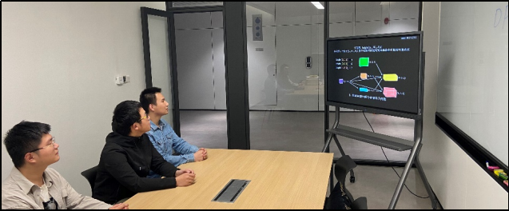
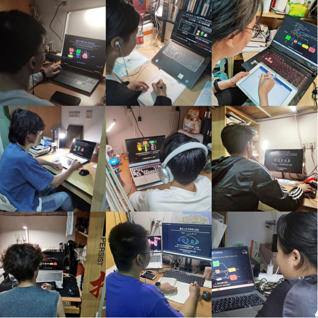

### 半内测优化后作品 - 西华师范大学

在优化后的版本中，我们联系了西华师范大学的一位算法老师，希望通过正式的课堂教学环境来测试我们的课程。反馈显示，学生对动态规划的兴趣显著提升，但也指出了一些问题，如难度梯度、练习题和资源链接的需求。针对这些反馈，我们进一步调整了课程内容：

- **课程选择性**：提供不同难度的课程选择，让学生能够根据自己的情况选择学习内容。
- **练习题和资源**：在课程末尾添加练习题和额外学习资源，增强知识点的巩固。
- **字幕和动画平衡**：优化字幕与动画的配合，确保学生既能理解内容又能欣赏动画。


### 全面推广 - 南充十中试点

将我们的课程推广至中学层面是一个重要的步骤，以验证其在更广泛年龄段和不同背景学生中的应用效果。我们选择了南充十中作为试点学校，通过实际课堂教学和调查问卷深入了解中学生对动态规划学习的接受程度和反馈。这一环节的目标是收集学生对互动式学习平台的使用感受，并据此优化用户界面和互动逻辑，以确保课程的适用性和有效性。


1. **课程引入与教学实施**：

   - **初步介绍**：在南充十中，我们首先向学生们介绍了动态规划的基本概念，并展示了课程的整体结构。
   - **课堂教学**：使用互动式学习平台，我们进行了多次教学活动，覆盖了“堆盒子”和“最长递增子序列（LIS）”两个问题。每节课结束后，学生可以通过平台进行在线测试和练习。
2. **调查问卷设计与分发**：

   - **设计问卷**：我们精心设计了调查问卷，包含有关课程内容、教学方式、互动体验和技术实现等多个方面的问题。
   - **分发问卷**：在每次课程结束后，我们向参与学习的学生分发问卷，并鼓励他们详细填写，以便我们获取真实有效的反馈。
3. **数据收集与分析**：

   - **收集反馈**：通过调查问卷和课堂观察，我们收集了大量关于学生学习体验的数据。
   - **分析数据**：对收集到的数据进行整理和分析，重点关注学生对课程内容的理解程度、互动学习平台的使用感受、以及对教学方法的建议。据此优化用户界面和互动逻辑。
     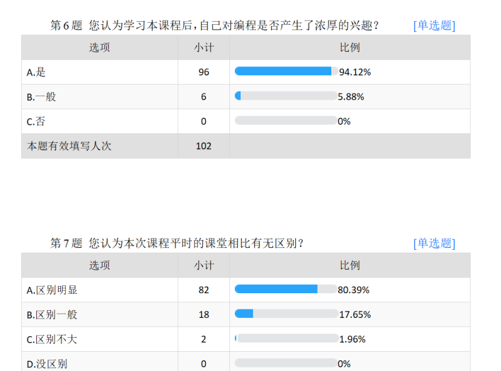

### 公益合作 - 启阳教育

我们与启阳教育合作，将课程应用于其算法教学与师资培训中，这一阶段的反馈验证了课程在职业教育领域的有效性。此合作不仅提高了课程的实际应用价值，也促进了我们团队的公益目标——普及高质量的算法教育资源。


通过多轮的“测试-收集反馈-修改-再测试”迭代过程，我们的课程已从一个基础微课发展成为一个包含互动视频、练习题和额外学习资源的全面教学平台。每一次迭代都深刻影响了课程的形态和质量，使其更加符合学生和教育工作者的需求。我们的目标是通过持续的优化和合作，使动态规划的学习变得更直观、更有趣、更有效，从而改变算法教育的现状。

## 作品效果

### 专业的可视化效果

#### Manim动画的精心制作

我们选择了Manim——一款由斯坦福大学的数学系学生Grant Sanderson开发的数学动画制作引擎，作为我们课程的核心可视化工具。Manim的选择基于其在处理复杂数学动画制作中的出色表现，尤其在著名的YouTube频道3Blue1Brown中得到广泛应用，展示了它在教学视频制作上的巨大潜力。本课程中，所有动画均由我们团队亲自编写，共计3600余行代码，确保每个动态规划的概念都能以最直观的方式展示给学习者。

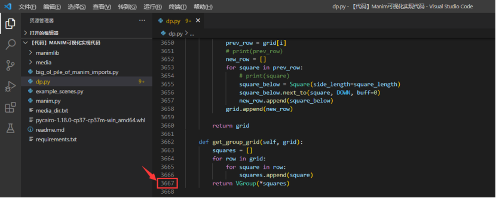
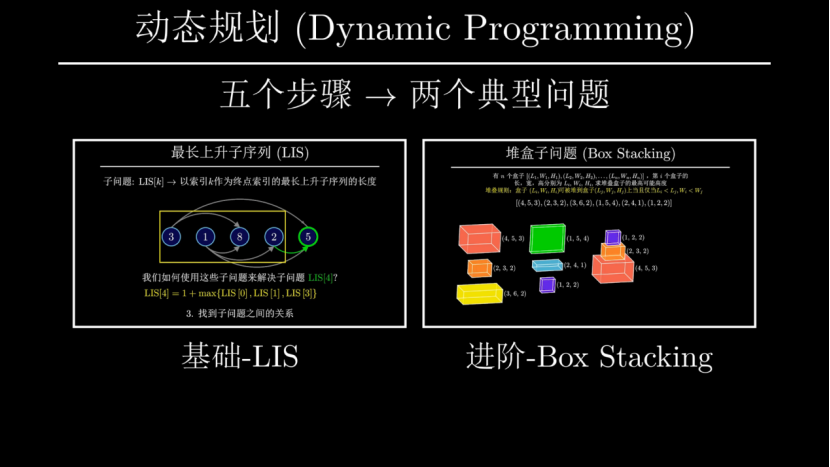
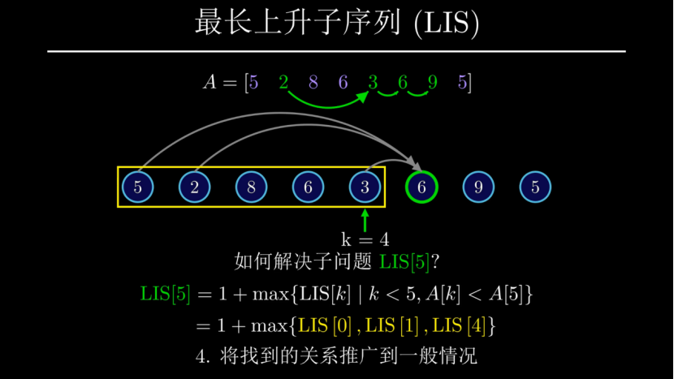

#### 课程的视觉效果

与传统的微课制作软件如“万彩动画大师”相比，Manim提供了一种更为科普和专业的

视觉风格，使学习者在享受视觉盛宴的同时，能够更深入地掌握所学的动态规划知识。这种专业级的可视化方法不仅提高了课程的吸引力，也增强了教学内容的理解和记忆。

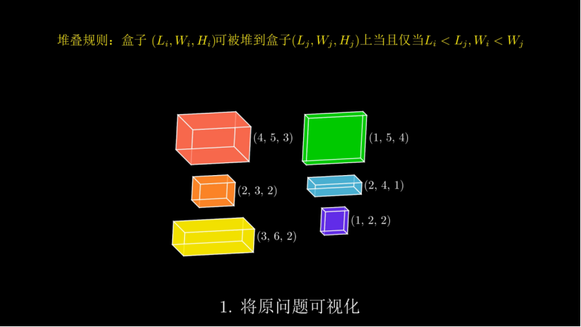
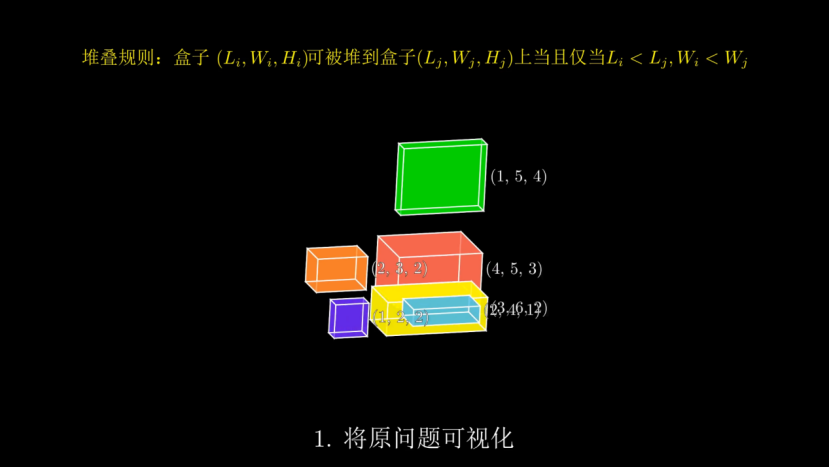
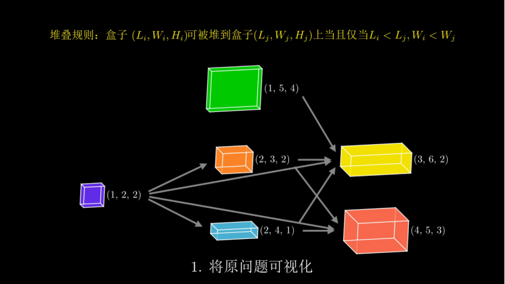

### “言出画随”与“动起来”的代码运行

#### “言出画随”的代码演示

本课程特别注重将理论与实践紧密结合。在讲解代码的部分，我们遵循“一句话概括一个步骤，一个步骤对应一段代码”的原则。这种方式不仅让学习者能够在听到每句解释的同时看到相应的代码实现，还能直观地理解每段代码背后的算法思想，真正做到了“言出画随”。

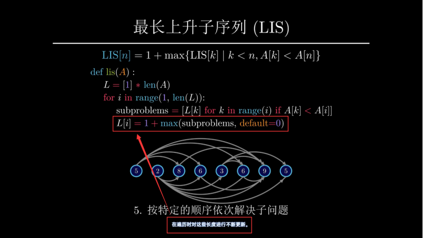
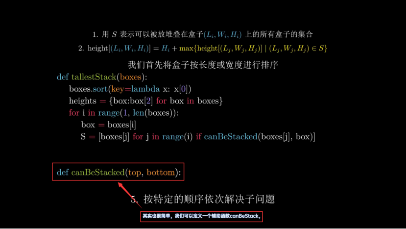

#### “动起来”的代码可视化

在课程的Box Stacking问题分支中，我们采用了顺应人类思维习惯的“代码可视化运行”步骤。这种正向的思维过程，即“伴随着代码的运行感受算法思维”，对于加深学生对动态规划算法的理解尤为有效，帮助学生以全新的方式接触和学习这一重要的计算机科学领域。


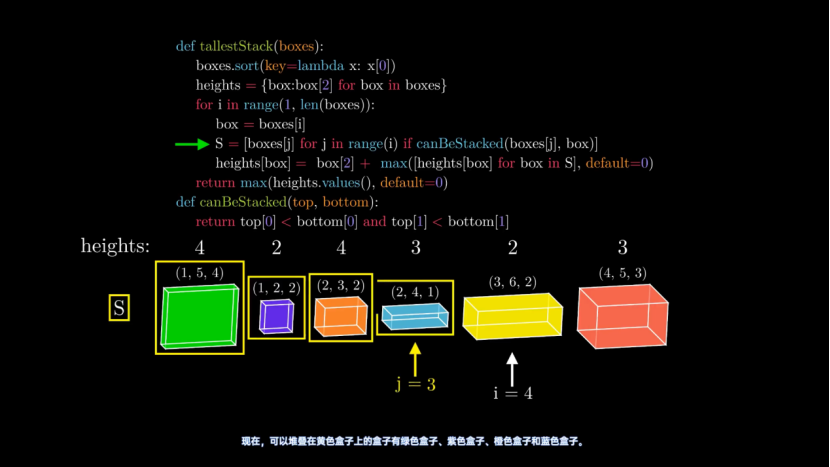

### 趣味性十足的问题引入

#### 情景设定

我们在课程开始部分设计了两个极具吸引力的情境来引入动态规划概念：

- **小偷问题**：学生扮演一个数理基础扎实的小偷，在多种限制条件下尝试偷取最多的财富。


- **荒漠求生**：学生化身为荒漠求生者，需要依靠一张沙漠地图寻找生存之路。

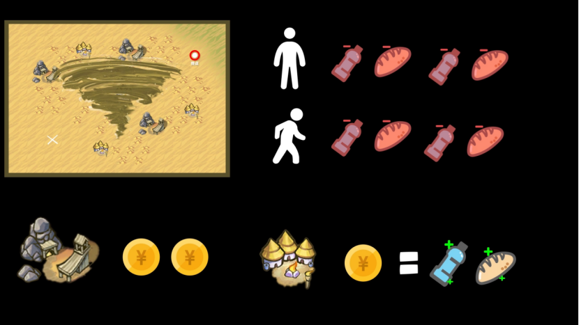

这些情境不仅激发了学习者的学习热情，还为动态规划的学习提供了直观的实际应用背景。

### 现实导向的应用场景介绍

在深入讲解动态规划的概念、知识体系和方法论后，我们的课程不仅局限于理论学习和解题技巧。在课程的尾声，我们特别强调动态规划在历史和现实中的重要应用，让学习者了解并体会到这一算法的深远影响和实际价值。

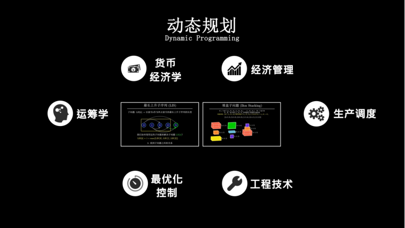

#### 历史贡献

我们首先探讨了动态规划在历史上的重要贡献，展示了它如何在过去的数十年中影响和推动了计算机科学的发展。通过介绍动态规划在解决复杂问题中的革命性角色，学生可以认识到这一技术的深刻内涵和它所能达到的高度。

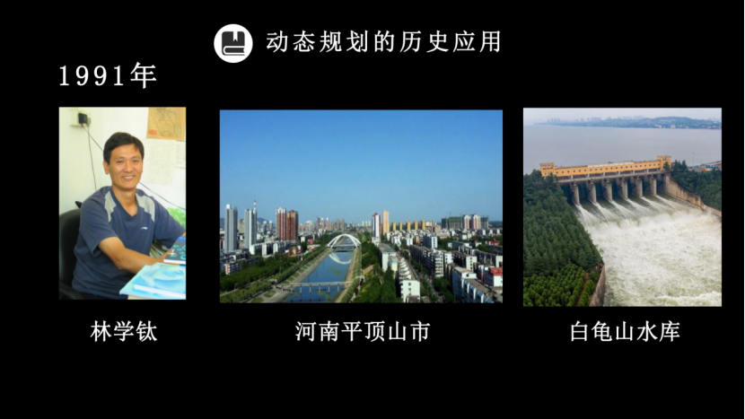

#### 现实世界的应用

进一步地，课程详细介绍了动态规划在当今世界各个领域的应用，包括经济规划、资源管理、网络数据传输、物流和供应链优化等。通过具体案例，我们展示了动态规划如何在实际中解决问题，并有效提升了操作效率和决策质量。这些现实世界的应用例证不仅让动态规划技术显得更加贴近生活，而且极大地激发了学习者深入研究和应用动态规划的兴趣。

通过这种方式，我们确保学生不只是学会了动态规划的技巧，而是能够理解其背后的哲学和在现实世界中的广泛应用，从而更全面地掌握这一强大的算法工具。


## 总结

我们的项目“从‘堆盒子’到动态规划”通过一系列精心设计的教学策略和工具，成功地将复杂的动态规划算法概念转化为直观、易理解的学习体验。通过使用专业级的Manim动画制作工具，结合互动式Web平台，我们不仅提高了教学的效果，也极大地增强了学生的学习动机和参与度。

### 创新教学方法

本项目通过结合Manim动画和互动式学习，为学生提供了一个既直观又参与感强的学习环境。动画的使用使得抽象的算法概念具象化，而互动视频则允许学生通过实践来深化理解，实现了从理论到实践的无缝对接。

### 持续迭代改进

通过多轮的“测试-收集反馈-修改-再测试”的迭代过程，我们确保了课程内容和教学方式始终贴近学生的实际需求和现代教育趋势。每一次的迭代不仅增强了课程内容的质量，也优化了教学交互体验，使课程更加完善。

### 实际应用与影响

课程强调动态规划在真实世界中的应用，通过具体案例让学生看到学到的算法在现实中的直接应用，从而增加了学习的相关性和动机。此外，与教育机构的合作推广还扩大了我们课程的影响力，为更广泛的教育领域带来了创新的教学模式。

综上所述，这一课程项目不仅提升了动态规划的教学效果，也展示了现代教学技术和方法在复杂科学概念教学中的应用潜力。通过持续的创新和改进，我们期待在未来能够进一步拓展其影响力，激发更多学生和教育工作者对算法学习和应用的兴趣。
